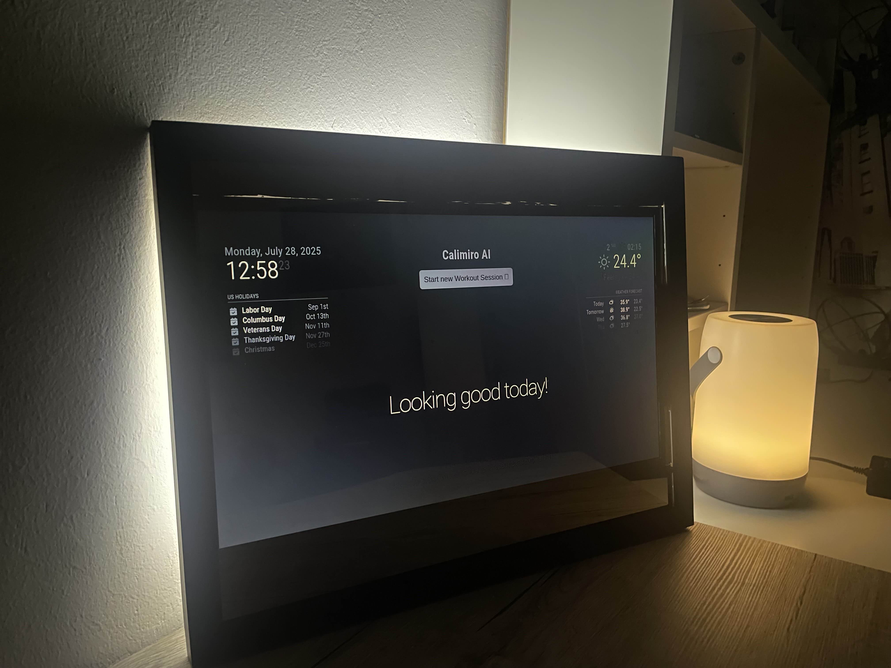

# Calimiro AI

<h2>A powerful smart mirror to film and track your workout session with AI.<br>
Built in Munich, Germany by Lennard Gross, Philip Synowiec und Younes Bendimerad</h2>

<br>




<br>

<h2>Getting started</h2>
<br>
Calimiro AI does not provide the required hardware to run any Calimiro device.
<br>
<br>
<h3>Installing</h3>
<br>
You can start by cloning the tracker repository and the mirror repository.

```
git clone https://github.com/calimiro-ai/calitracker
git clone https://github.com/calimiro-ai/calimirror
```
<br>
<h3>Start Calitracker</h3><br>

Run the calitracker server on your OS

```
cd calitracker
python src/backend_interface/server.py
```

<br>
<h3>Start Calimirror</h3>
<br>
You can update the required dependencies for your MagicMirror server for the frontend with:

```
cd calimirror
npm install
```

Run it with:
```
npm run server
```

You will see your mirror run by pointing your browser to: <SERVER IP>:8080

<br>
<h3>Configure your mirror</h3>
<br>
You can change the port or the IP address by editing the config/config.js file of calimirror. Please see the <a href="https://www.docs.magicmirror.builders">MagicMirror documentation</a> for details.

<br><br><br>

Copyright &copy; Lennard Gross, Philip Synowiec and Younes Bendimerad, 2025. All rights reserved.